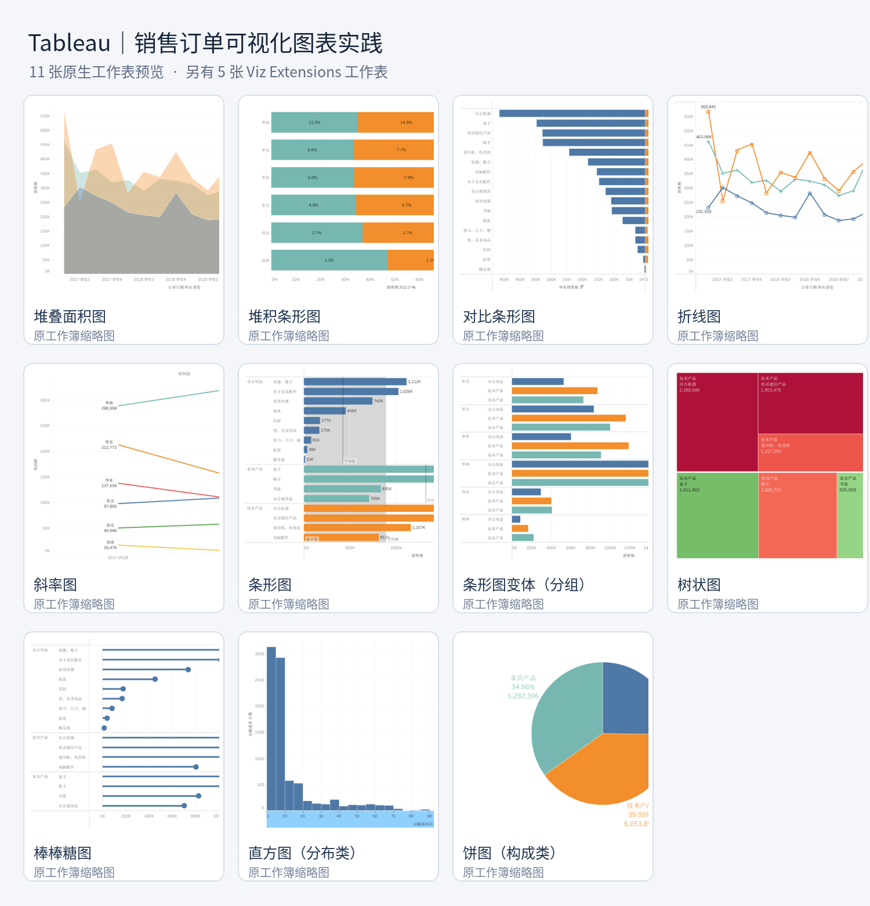

# Tableau 数据可视化练习：16 种图表实现

> Tableau Visualization Practice | 16 Charts with Sales Order Data

这是一个 Tableau 数据可视化学习与实操项目。使用同一份销售订单数据，围绕**构成、比较、趋势、分布**四类分析需求，练习 16 种常见和进阶图表的制作方法。

本仓库保存的是**16 张独立 Tableau 工作表**，并非已经整合好的交互式 Dashboard。项目以图表类型探索、字段映射与可视化方法练习为主。

## 项目预览



> 图中展示了 11 张原生工作表的缩略图。其余 5 张采用 Viz Extensions（可视化扩展），因打包工作簿内缩略图未渲染，未放入这张预览图；请在兼容的 Tableau 版本中打开工作簿查看。

## 图表清单

| 分析主题 | Tableau 工作表 | 主要表达的内容 |
| --- | --- | --- |
| 构成与层级 | 饼图（构成类） | 产品类别的销售额构成 |
| 构成与层级 | 环形图 | 产品类别销售额构成与指标呈现 |
| 构成与层级 | 旭日图 | 产品类别—产品子类别的层级构成 |
| 构成与层级 | 树状图 | 面积表示销售额、颜色表示利润额 |
| 构成与层级 | 维诺图 | Voronoi Treemap 扩展图形 |
| 构成与层级 | 堆积条形图 | 不同区域中产品类别的销售额占比 |
| 分类比较 | 条形图 | 产品类别、子类别的销售额比较 |
| 分类比较 | 条形图变体（分组） | 区域与产品类别的分组比较 |
| 分类比较 | 对比条形图 | 华东与华北销售额对比 |
| 分类比较 | 棒棒糖图 | 条形与圆点标记的组合呈现 |
| 分类比较 | 南丁格尔玫瑰图/极光花图 | 省份销售额的极坐标展示 |
| 指标展示 | 仪表图 | 利润额指标的仪表式展示 |
| 趋势分析 | 折线图 | 随订单日期变化的销售额趋势 |
| 趋势分析 | 堆叠面积图 | 不同产品类别的销售额随时间变化 |
| 趋势分析 | 斜率图 | 不同时间段各区域的利润额变化 |
| 分布分析 | 直方图（分布类） | 运输成本的频数分布 |

## 数据与技术

- **工具**：Tableau Desktop；工作簿保存时的版本信息为 **2026.2.3**。
- **数据源名称**：`全国订单明细 (某公司销售数据)`。
- **主要字段**：订单日期、区域、省份、城市、产品类别、产品子类别、销售额、利润额、运输成本等。
- **文件格式**：`.twbx`（打包工作簿），内含 Tableau 工作簿和 `.hyper` 数据提取文件。
- **扩展图表**：旭日图（Tableau Radial）、环形图、仪表图、南丁格尔玫瑰图、维诺图（后四种采用 LaDataViz 扩展）。

### 计算字段示例

“对比条形图”使用了按区域提取销售额的两个计算字段：

```tableau
// 华东销售额
IF [区域] = '华东' THEN [销售额] END

// 华北销售额
IF [区域] = '华北' THEN [销售额] END
```

“直方图（分布类）”使用了运输成本数据桶，数据桶大小为 `5`。

## 项目结构

```text
tableau-sales-16-charts/
├── README.md
├── workbooks/
│   └── tableau_sales_16_charts.twbx
└── assets/
    └── preview-native.png
```

## 如何使用

1. 下载 `workbooks/tableau_sales_16_charts.twbx`。
2. 使用支持相应工作表与 Viz Extensions 的 Tableau Desktop 打开。
3. 从底部工作表标签依次查看 16 种图表，并根据需要调整字段与图形设置。
4. 若扩展图表无法正常加载，请检查 Tableau 版本、扩展访问权限及网络环境；若出现数据源连接提示，请先检查打包文件中的数据提取是否可用。

## 说明

- 本项目主要用于可视化方法学习和个人实操记录，不代表完整商业分析报告，也不包含已经制作好的 Dashboard。
- **公开发布前请核查数据授权与隐私**：源字段包含“顾客姓名”，打包文件还包含数据提取，请确认数据属于可公开分享的教学/示例数据，或先进行脱敏与替换。
- 原数据文件的公开来源与再分发许可尚未在项目中确认，因此此处不声明数据为开放数据，也不添加默认开源许可证。

## 相关文章

- CSDN 实操记录：**发布后在这里补充文章链接**。

---

**关键词**：`Tableau` · `Data Visualization` · `Business Intelligence` · `图表设计` · `可视化实操`
